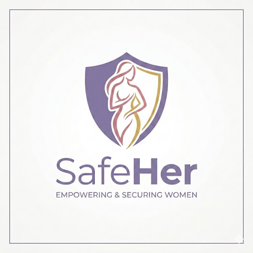

# 💜 SafeHer — Empowering & Securing Women



> **"You are not alone. We are here."**

SafeHer is a digital platform for the protection and empowerment of Indonesian women. Built to provide a safe space, access to professional help, and a supportive community.

---

## 🌐 Live Website
**[https://cacastudymarket.github.io/safeher/](https://cacastudymarket.github.io/safeher/)**

---

## ✨ Key Features

| Feature | Description |
|---------|-------------|
| 🆘 **Emergency Button** | One-click SOS, sends location to emergency contacts |
| 📖 **Safe Space Stories** | Share experiences anonymously |
| 📚 **Education Center** | Women's rights articles & educational quizzes |
| 🗺️ **Safety Map** | Real-time incident reports based on map |
| 🤝 **Community & Buddy** | Discussion forum & buddy system |
| ⚖️ **Report Guide** | Step-by-step police reporting + downloadable templates |
| 💬 **Expert Consultation** | Free QnA & paid private consultation |
| 💝 **Transparent Donation** | Verified donations with real-time updates |
| 📊 **Mood Tracker** | Track daily mental health |
| 🏅 **Badge & Appreciation** | Points system & community rewards |
| 🤖 **SafeHer AI** | Gemini-powered AI bot for guidance & support |

---

## 👥 User Types

- **Regular Member** — Women who want to use SafeHer services (ID verification required)
- **Expert Professional** — Verified psychologists, psychiatrists, legal experts
- **Admin Team** — SafeHer core team for moderation & verification

---

## 🛠️ Tech Stack

- **Frontend:** HTML5, CSS3, Vanilla JavaScript
- **Maps:** Leaflet.js + OpenStreetMap
- **AI Bot:** Google Gemini API
- **Hosting:** GitHub Pages
- **Version Control:** Git & GitHub

---

## 📁 Folder Structure
```
safeher/
├── index.html          # Main page
├── assets/
│   ├── css/            # Stylesheets
│   ├── js/             # JavaScript files
│   └── images/         # Logo & images
├── components/
│   ├── navbar.html     # Global navbar
│   └── footer.html     # Global footer
└── pages/
    ├── darurat.html
    ├── ruang-cerita.html
    ├── edukasi.html
    ├── safety-map.html
    ├── komunitas.html
    ├── panduan-lapor.html
    ├── konsultasi.html
    ├── donasi.html
    ├── mood-tracker.html
    ├── badge.html
    ├── login.html
    ├── register.html
    └── admin.html
```

---

## 🚀 Roadmap

- [x] Full access website with all features
- [x] AI Bot (Gemini)
- [x] GitHub Pages deployment
- [ ] Dark mode & multilanguage fix
- [ ] Upgrade bot to Claude AI
- [ ] Educational podcast
- [ ] Android & iOS application
- [ ] Backend & database integration

---

## 👩‍💻 Development Team

Developed as a student project to help Indonesian women feel safer and more empowered.

---

## 📞 Emergency Hotlines

| Institution | Number |
|-------------|--------|
| Komnas Perempuan | 021-3903963 |
| SAPA Kemensos | 129 |
| Police | 110 |
| Ambulance | 118 |

---

*SafeHer — Empowering & Securing Women 💜*